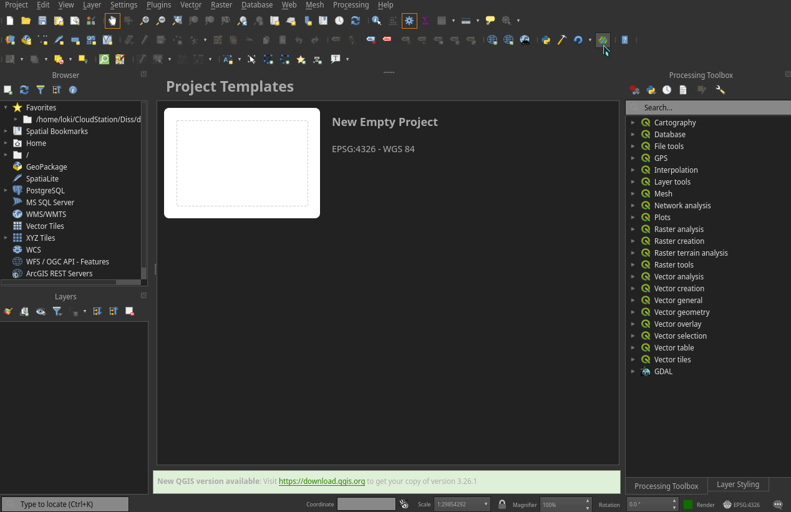

# GADM Loader
> Conveniently download GADM Data from within QGIS.

GADM loader is a QGIS plugin that allows you to download GADM data and add them directly to your QGIS project.

## Demo

## Installation

For now, as the plugin is not yet available via QGIS directly, you can install the plugin from a zip
file:

1. Click the `Code`-Button at the top of the page and click `Download ZIP`.
2. In QGIS, click `Plugins`, `Manage and Install Plugins...`, `Install from ZIP`, select the downloaded ZIP from your file system.
3. Click `Install Plugin`. You will have to accept the warning.

## Acknowledgements

This plugin acquires data from https://gadm.org. Without their dedicated work, this plugin would not
be possible. Please use their service humbly and only download the data you need. Also see their data policy:

> The data are freely available for academic use and other non-commercial use. Redistribution, or
  commercial use is not allowed without prior permission.

To quote from their [About page](https://gadm.org/about.html):

> GADM wants to map the administrative areas of all countries, at all levels of sub-division. We use
  a high spatial resolution, and of a extensive set of attributes. This is a never ending project,
  but we are happy to share what we have.
